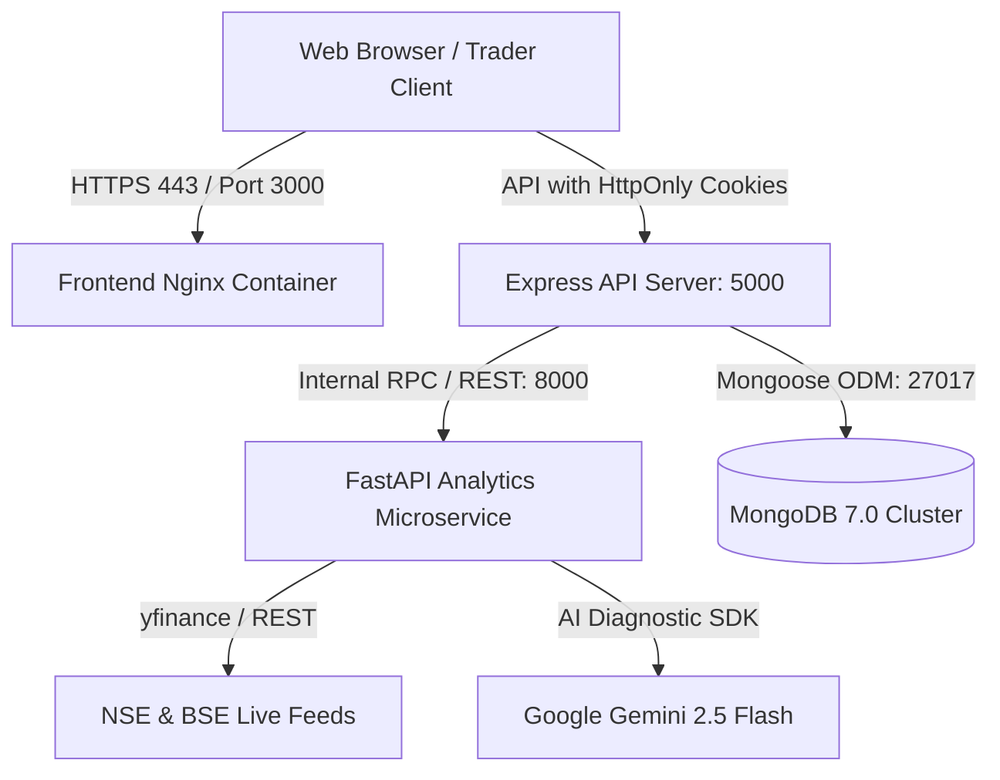

# foliolysis — Institutional Quantitative Trading & Risk Simulator

[](https://react.dev/)
[](https://vitejs.dev/)
[](https://nodejs.org/)
[](https://fastapi.tiangolo.com/)
[](https://python.org/)
[](https://www.docker.com/)
[](https://opensource.org/licenses/MIT)

**foliolysis** is an institutional-grade, full-stack quantitative algorithmic backtesting, macroeconomic risk modeling, and stochastic forward projection platform engineered for Indian equities (**NSE & BSE**) and global benchmarks.

Powered by a high-precision **NumPy/Pandas vectorized calculation engine**, a hardened **Node.js Express API**, and a modern **React 18 SPA** with matte Groww-inspired aesthetics, foliolysis equips traders and quantitative fund managers with the analytical rigor required to stress-test strategies across historical and simulated market regimes.

---

## 🏛️ System Architecture



### Microservice Architecture
1. **Frontend (`/frontend`)**: React 18 single-page application built with Vite, Chart.js, Three.js, Lucide Icons, domain-driven feature packaging (`@/features/*`), route-level chunking (<150KB initial bundle), and error boundaries.
2. **Backend (`/backend`)**: Modular Node.js Express API with dedicated route domains (`backend/routes/`), `helmet` CSP, `cors` origin whitelisting, `zod` input validation, `express-rate-limit`, structured JSON logging, and JWT authentication delivered via `HttpOnly`, `SameSite=Strict`, `Secure` cookies.
3. **Analytics Engine (`/analytics`)**: Python 3.11 FastAPI microservice computing vectorized backtests, trailing stop-losses, Value-at-Risk (VaR/CVaR), and 500+ path Geometric Brownian Motion (GBM) Monte Carlo projections.
4. **Data Tier**: MongoDB document store with automatic in-memory persistence fallback for zero-downtime development and evaluation.

### Modular Project Layout
```
fintech-risk-simulator/
├── frontend/
│   ├── src/
│   │   ├── components/         # Shared presentation layer
│   │   │   ├── common/         # Logo, ErrorBoundary, OfflineBanner, SkeletonLoaders
│   │   │   └── layout/         # Sidebar, GlobalHeader (StockSearch, BenchmarkBar, UserProfile)
│   │   ├── config/             # Environment & API configurations (env.js)
│   │   ├── constants/          # Stocks, endpoints, defaults, market presets
│   │   ├── context/            # AuthContext, ToastContext barrels
│   │   ├── features/           # Domain-driven feature modules
│   │   │   ├── auth/           # AuthModal, validation schemas
│   │   │   ├── dashboard/      # TelemetryCardsGrid, EquityCurveChart, MarketMoversCard
│   │   │   ├── strategies/     # StrategyConfigPanel, StrategyMetricsGrid, StrategyChart
│   │   │   ├── simulations/    # Monte Carlo GBM engine, TrajectoryFanChart, Histogram
│   │   │   ├── risk/           # MacroStressScenarios, RiskVisualizerCard
│   │   │   ├── reports/        # ReportsFilterBar, ReportsTable, ReportDossierModal
│   │   │   ├── settings/       # ProfileSettings, TradingRules, Brokerage, Notification
│   │   │   └── landing/        # HeroThreeCanvas, LandingHeader, LandingHeroSection
│   │   ├── hooks/              # Custom hooks (useDebounce, useClickOutside)
│   │   ├── services/           # Data & infrastructure clients (apiClient, marketService, etc.)
│   │   ├── utils/              # Calculation helpers & formatters (currency, percent, dates)
│   │   └── App.jsx             # Code-split router orchestrator (<100 lines)
│   ├── jsconfig.json           # Path aliasing (@/* -> src/*)
│   └── vite.config.js          # Vite configuration with chunk splitting & alias
├── backend/
│   ├── config/                 # Database initialization & in-memory fallback (db.js)
│   ├── middleware/             # Rate limiters, JWT cookie auth, security policies
│   ├── models/                 # Mongoose schemas (User, Backtest, Portfolio)
│   ├── routes/                 # Domain-driven route controllers
│   │   ├── auth.routes.js      # Register, Login, Me, Guest, Logout
│   │   ├── market.routes.js    # Live index & market overview feeds
│   │   ├── backtest.routes.js  # Dual SMA execution & history
│   │   ├── simulation.routes.js# Monte Carlo & macro stress testing
│   │   ├── portfolio.routes.js # Portfolio CRUD operations
│   │   └── health.routes.js    # Liveness & readiness probes
│   ├── utils/                  # Structured JSON logger
│   ├── validators/             # Zod input validation schemas
│   └── server.js               # Clean bootstrap (<90 lines)
└── analytics/                  # Python FastAPI quantitative engine
```

---

## ⚡ Core Platform Modules

| Module | Route | Capabilities |
| :--- | :--- | :--- |
| **Home** | `/` | Minimalist brand showcase featuring the prominent foliolysis emblem, live NIFTY 50/SENSEX indices capsule, and instant terminal launch. |
| **Dashboard** | `/dashboard` | Executive telemetry overview: total portfolio wealth curves, portfolio alpha vs NIFTY 50, India VIX regime monitoring, and active strategy health toggles. |
| **Strategies** | `/strategies` | Dual SMA (20/50, 15/45) momentum sandbox, trailing stop-loss simulation, synchronized price & volume charts with buy/sell execution markers, and automated Gemini AI risk diagnostics. |
| **Risk Analysis** | `/risk-analysis` | 95% Value-at-Risk (VaR) & Conditional VaR (Expected Shortfall), macroeconomic stress scenarios (RBI repo rate shifts, crude price spikes, market crashes), and factor sensitivities. |
| **Simulations** | `/simulations` | 500-path Geometric Brownian Motion (GBM) Monte Carlo forward projections with bull (95th), median (50th), and bear (5th) percentile wealth boundaries and terminal wealth histograms. |
| **Reports** | `/reports` | Interactive compliance audit dossiers with clickable rows, detailed trade logs, performance metrics (CAGR, Sharpe, Max Drawdown), and one-click CSV export. |
| **Settings** | `/settings` | Trader profile management, INR capital limits, notifications, and broker integration status (Zerodha Kite Connect). |

---

## 🛡️ Security & DevSecOps Hardening

- **Secure Session Management**: Authentication tokens are issued as signed JWTs stored exclusively in `HttpOnly`, `SameSite=Strict`, `Secure` cookies—mitigating client-side XSS token exfiltration.
- **Application Security (AppSec)**:
  - `helmet` Content Security Policy (CSP), anti-clickjacking frameguard, and referrer policy.
  - Strict input validation enforced with `Zod` across all authentication and calculation payloads.
  - Tiered rate limiting with `express-rate-limit` protecting authentication routes (20 req / 15 min) and simulation engines (45 req / min).
- **Client Resilience**:
  - `ErrorBoundary` captures unhandled exceptions with diagnostic stack traces and recovery buttons.
  - `OfflineBanner` alerts users to internet drops with real-time network listeners.
  - `ToastContext` delivers non-blocking, accessible system notifications.
  - `SkeletonLoaders` prevent layout shift during Chart.js and data-fetching cycles.
- **Observability**: Structured JSON logging (`timestamp`, `level`, `requestId`, `latencyMs`, `method`, `path`) and `/health` and `/ready` probes for automated container orchestration.
- **Least Privilege**: All production containers execute under dedicated non-root users (`node`, `appuser`, `nginx`).

---

## 🚀 Getting Started

### Option 1: Fast Launch with Docker Compose (Recommended)

```bash
# 1. Clone repository
git clone https://github.com/your-username/foliolysis.git
cd foliolysis

# 2. Configure environment
cp .env.example .env

# 3. Launch full stack
docker compose up -d --build

# 4. Open in browser
# Frontend: http://localhost:3000
# Backend API: http://localhost:5000/health
# Analytics: http://localhost:8000/health
```

### Option 2: Windows Native Multi-Service Launcher

```powershell
# Double click or run start-all.bat in PowerShell
.\start-all.bat
```
This script launches all three microservices in independent terminal windows:
- Python Analytics on `http://127.0.0.1:8000`
- Express Backend on `http://localhost:5000`
- React Frontend on `http://localhost:3000`

### Option 3: Manual Step-by-Step Setup

#### 1. Analytics Microservice (Python)
```bash
cd analytics
python -m venv venv
.\venv\Scripts\activate   # Windows
# source venv/bin/activate # Linux/macOS
pip install -r requirements.txt
python main.py
```

#### 2. Backend API (Node.js)
```bash
cd backend
npm install
npm run dev
```

#### 3. Frontend SPA (React + Vite)
```bash
cd frontend
npm install
npm run dev
```

---

## 📡 API Reference

| Method | Endpoint | Description | Auth Required |
| :--- | :--- | :--- | :---: |
| `GET` | `/health` | Liveness health check | No |
| `GET` | `/ready` | Readiness check (validates MongoDB & Analytics) | No |
| `POST` | `/api/auth/register` | Register new trader account | No |
| `POST` | `/api/auth/login` | Sign in & receive HttpOnly cookie | No |
| `GET` | `/api/auth/me` | Fetch authenticated session profile | Yes |
| `POST` | `/api/auth/guest` | Instant Guest Sandbox activation | No |
| `POST` | `/api/auth/logout` | Clear session cookie | No |
| `GET` | `/api/market/overview` | Indian equity benchmarks & market movers | No |
| `POST` | `/api/backtest/run` | Execute quantitative dual SMA backtest | Optional |
| `GET` | `/api/backtest/history` | Historical backtest audit records | Optional |
| `POST` | `/api/analytics/monte-carlo` | Compute 500-path GBM forward projection | Optional |
| `ALL` | `/api/analytics/stress-test` | Macroeconomic stress scenario profiles | Optional |
| `GET` | `/api/portfolios` | List user portfolios | Optional |
| `POST` | `/api/portfolios` | Create customized portfolio allocation | Optional |
| `DELETE` | `/api/portfolios/:id` | Remove portfolio record | Optional |

---

## 🛠️ Testing & Verification

```bash
# Build production bundle with route chunking
cd frontend && npm run build

# Run backend automated health & security checks
cd backend && node -e "fetch('http://localhost:5000/ready').then(r=>r.json()).then(console.log)"
```

---

## 📄 License
This project is licensed under the MIT License — see the [LICENSE](LICENSE) file for details.
